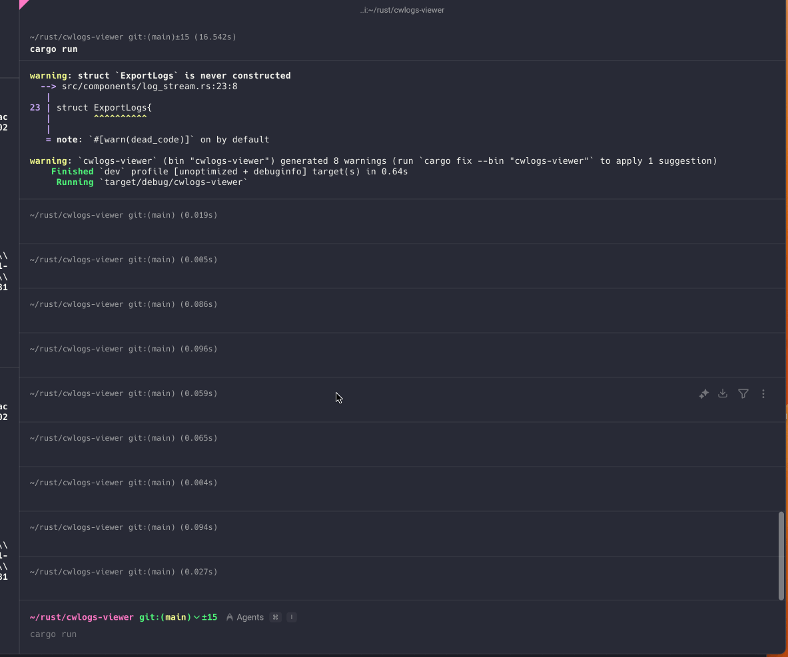

# cwlogs-viewer

Amazon CWLogsをLiveTrailでいい感じに表示するやつ  
左側のペインにログが表示され、右側のペインには詳細情報が表示されます  
ペインの切り替えは`Tab`キーで行います

- 左側のペインでは、ロググループを選択します。`Enter`で選択できます
- 右側のペインでは、発生したログが表示されます。`Enter`で選択します
  - `e`で選択されたすべてのログをファイルにエクスポートします
  - `c`でカーソルが当たっているログのURLをクリップボードにコピーします
- `q`キーでアプリケーションを終了します

## Demo



### Export to file


[Example log file: `saved_logs_20250607_180919.jsonl`](saved_logs_20250607_180919.jsonl)

### Copy log's URL to clipboard


## Installation

```
export CWLOGS_VIEWER_LOG_LEVEL=debug
export CWLOGS_VIEWER_DATA=`pwd`/.data
cargo run
```


## Test script

```
while true; do
  aws logs put-log-events --log-group-name *** --log-stream-name '***' --log-events "[
    {
      \"timestamp\": $(date +%s)000,
      \"message\": \"hello from $(date +%s)\"
    },
    {
      \"timestamp\": $(date +%s)600,
      \"message\": \"bye from $(date +%s)\"
    },
    {
      \"timestamp\": $(date +%s)800,
      \"message\": \"{\\\"message\\\": {\\\"hello from cli\\\": \\\"value\\\", \\\"obj1\\\":{\\\"obj1-1\\\": {\\\"obj1-1-1\\\": \\\"hello from cli\\\",\\\"obj1-1-2\\\": true}}}, \\\"otherProps\\\": \\\"hoge\\\",\\\"otherProps2\\\": \\\"hoge\\\",\\\"otherProps3\\\": \\\"hoge\\\", \\\"bool\\\": true, \\\"number\\\": 123214812151421 }\"
    }
  ]"  > /dev/null
  sleep 5
done
```
